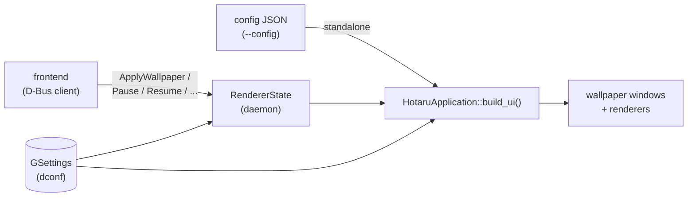
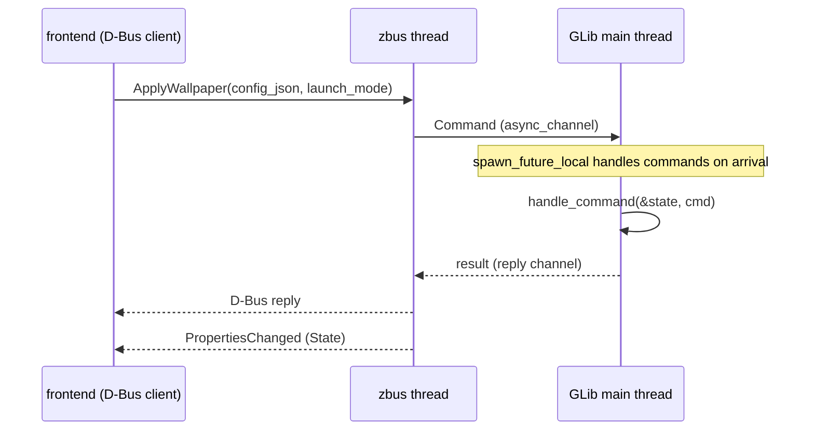

# Hotaru Architecture

Hotaru is a live wallpaper **renderer backend**: it draws video, web, and
Wallpaper Engine packages (scene/video/web)
as desktop wallpaper on X11 (EWMH desktop windows) and Wayland (layer shell),
and acts as the rendering engine for the
[GNOME Hanabi Extension](https://github.com/jeffshee/gnome-ext-hanabi).
It is a GTK4 application written in Rust.

This document describes the system as a whole. The rendering subsystem has its
own document: [renderers.md](renderers.md).

## Process model

Hotaru runs in one of two modes, selected by the CLI:

```
hotaru --config <file.json> [--launch-mode <mode>]   # standalone
hotaru --daemon                                      # D-Bus daemon
```

`--launch-mode` accepts (details in [Windows and launch modes](#windows-and-launch-modes)):

| Mode | Purpose |
|---|---|
| `x11-desktop` | X11/XWayland EWMH desktop window |
| `wayland-layer-shell` | Wayland background layer (wlr-layer-shell) |
| `gnome-ext-hanabi` | Window managed by the GNOME Hanabi extension |
| `windowed` | Regular window, for development/testing |

**Launch-mode resolution** — the effective mode is, in order:

1. an explicit `--launch-mode` (or, in the daemon, the mode a D-Bus
   `ApplyWallpaper` carries);
2. in the daemon, the persisted last-used mode, so auto-restore resumes
   exactly what was showing;
3. otherwise **auto-detection**: `wayland-layer-shell` where the compositor
   supports layer-shell (KDE, wlroots, …), else `x11-desktop` (GNOME and X11
   sessions). `gnome-ext-hanabi` and `windowed` are only ever explicit.

`x11-desktop` on a Wayland session re-execs the process with
`GDK_BACKEND=x11` to run on XWayland. The GDK backend is fixed once per
process; a daemon `ApplyWallpaper` whose mode needs the other backend is
rejected with a descriptive error but persisted first — restarting the
daemon then boots on the right backend and restores it.

**Standalone mode** reads a wallpaper config JSON from disk, builds the
wallpaper windows immediately, and runs until killed. It is the direct way to
use Hotaru and the mode used for development and testing. It never reads or
writes the persisted `last-*` state.

**Daemon mode** owns the session bus name `io.github.jeffshee.Hotaru` and
waits for commands from a frontend. It registers the D-Bus service
before `GApplication` registration so D-Bus activation callers find the
interface as soon as the process starts, holds the application alive with no
windows open, and auto-restores the last applied wallpaper on startup. Every
apply — accepted or backend-rejected — persists `last-wallpaper-config` /
`last-launch-mode`, so a daemon restart always converges on the last request.



## Module map

```
src/
├── main.rs             CLI parsing, mode dispatch
├── application.rs      HotaruApplication, build_ui(), XWayland fallback
├── window.rs           HotaruApplicationWindow, per-launch-mode window setup
├── state.rs            RendererState: active wallpaper, rebuild path/triggers
├── dbus.rs             D-Bus service + command channel
├── settings_watcher.rs GSettings access + runtime change propagation
├── monitor_watcher.rs  GObject emitting "monitor-changed" on hotplug
├── clip_box.rs         ClipBox viewport-clipping container
├── cli.rs              clap definitions (binary only)
├── config.rs           build-time config (version/pkgdatadir, meson-injected)
├── constants.rs        application IDs, Wallpaper Engine app id
├── wpe.rs              Wallpaper Engine package resolution (project.json)
├── model/
│   ├── wallpaper_config.rs   WallpaperConfig JSON schema (serde)
│   ├── window_layout.rs      config + monitors → WindowLayout/Viewport
│   ├── video_renderer.rs     VideoRenderer enum (mpv | gst-gtk4)
│   ├── launch_mode.rs        LaunchMode enum (glib::Boxed)
│   ├── monitor.rs            MonitorInfo/MonitorMap helpers
│   └── hanabi_params.rs      window-title protocol for Hanabi
└── renderer/
    ├── mpv.rs          MpvWidget (libmpv render API into GLArea)
    ├── gstgtk4.rs      GstGtk4Widget (gst-play + gtk4paintablesink)
    ├── web.rs          WebWidget (WebKitGTK)
    ├── scene.rs        SceneWidget (linux-wallpaperengine embed API)
    └── gl_loader.rs    process-wide GL symbol resolver (mpv + scene)
```

The crate builds as a library (`hotaru::*`) plus a thin binary (`main.rs`,
`cli.rs`).

## Wallpaper configuration

A wallpaper is described by a JSON `WallpaperConfig`:

```json
{
    "mode": "wallpaper_per_monitor | clone_single_wallpaper | stretch_single_wallpaper",
    "monitors": [
        { "monitor": "DP-5", "wallpaper_type": "video", "filepath": "/path/video.mp4" },
        { "monitor": "DP-4", "wallpaper_type": "web",   "uri": "https://example.org/" },
        { "monitor": "DP-3", "wallpaper_type": "wpe",   "workshop_id": "1771553708" },
        { "monitor": "HDMI-1" }
    ]
}
```

- `monitor` is the connector name (`DP-5`, `HDMI-1`, …). In stretch mode the
  name is not matched against real monitors (examples use `"STRETCH"`).
- `wallpaper_type` is `video`, `web`, or `wpe` (a Wallpaper Engine package,
  which dispatches to a renderer by its `project.json` type — see
  [renderers.md](renderers.md)).
- The source is `filepath`, `uri`, or `workshop_id` (serde-flattened union;
  `workshop_id` is only valid with `wpe`).
- An entry with only `monitor` is a **clone** target (used by
  `clone_single_wallpaper`).

### Window layout

`WindowLayout::new(config, monitor_map)` translates the config plus the
current monitor geometry into a list of `WindowInfo` values, one per window:

| Mode | Result |
|---|---|
| `wallpaper_per_monitor` | One `Primary` window per configured monitor, sized to that monitor. |
| `clone_single_wallpaper` | One `Primary` window plus one `Clone` window per clone entry. Clones mirror the primary's output instead of decoding again. |
| `stretch_single_wallpaper` | A virtual canvas spanning the bounding box of all monitors. The first monitor gets a `Primary` window, every other monitor a `Clone`; each carries a `Viewport` describing its slice of the canvas. |

A `Viewport { offset_x, offset_y, canvas_width, canvas_height }` is realized
by the `ClipBox` widget: the child (renderer) is allocated at full canvas
size, translated by the offset, and clipped to the window size, so each
monitor shows only its region of one large wallpaper.

## Windows and launch modes

`HotaruApplicationWindow` is an undecorated, black-background
`GtkApplicationWindow` whose behavior depends on `LaunchMode`:

| Mode | Mechanism |
|---|---|
| `x11-desktop` | Sets `_NET_WM_WINDOW_TYPE_DESKTOP` (EWMH) via x11rb, positions the window with `ConfigureWindow`, and clears `_GTK_FRAME_EXTENTS` so Mutter draws no shadow. If the session is Wayland, the process **re-execs itself with `GDK_BACKEND=x11`** to run on XWayland (`fallback_to_xwayland`). |
| `wayland-layer-shell` | gtk4-layer-shell: `Layer::Background`, anchored to all four edges, exclusive zone −1, keyboard mode `None`, pinned to the target monitor by connector name. |
| `gnome-ext-hanabi` | Encodes `HanabiParams` as compact JSON into the **window title**: `@io.github.jeffshee.Hotaru!{"p":[x,y],"b":true,"m":true,"k":true}` (`p` position, `b` keep-at-bottom, `m` keep-minimized, `k` keep-position). The Hanabi shell extension reads the title and manages the window on the GNOME Shell side. |
| `windowed` | Plain decorated window. Development/testing. |

Every window installs a frame-clock tick callback that logs frames-per-second
per monitor at `debug` level — useful for measuring delivered frame rate.

## build_ui

`HotaruApplication::build_ui()` ([application.rs](../src/application.rs)) is
the single path that materializes a wallpaper, used by both modes:

1. Query the current monitor map, compute the `WindowLayout`.
2. For each `Primary` window: create the window, create the `Renderer`
   (see [renderers.md](renderers.md)), apply the content-fit setting, wrap in
   a `ClipBox` if a viewport is present, present, `play()`.
3. For each `Clone` window: call `mirror()` on its primary's renderer, which
   yields a lightweight `gtk::Picture` bound to the primary's output — one
   decode pipeline drives all clones.
4. Store the primary renderers in a shared `Rc<RefCell<Vec<Renderer>>>` so
   settings changes and D-Bus commands can reach them later.

### Rebuild triggers

The wallpaper is torn down (all windows closed) and rebuilt through the same
path when:

- **Monitors change** — `MonitorWatcher` emits `monitor-changed` on hotplug
  (connected to `GdkMonitors` `items-changed`).
- **The `video-renderer` setting changes** — switching renderer takes effect
  immediately, no restart required.
- **D-Bus `ApplyWallpaper`** arrives (daemon mode).

Both modes share one `RendererState` ([state.rs](../src/state.rs)): all
triggers funnel through `RendererState::rebuild_ui()` (wired by
`watch_changes()`), which re-reads settings and calls `build_ui`.

## Settings (GSettings)

Schema `io.github.jeffshee.Hotaru`
([gschema.xml](../data/io.github.jeffshee.Hotaru.gschema.xml)):

| Key | Type | Default | Notes |
|---|---|---|---|
| `video-renderer` | `s` | `mpv` | `mpv` or `gst-gtk4`. Live-switches the active wallpaper. |
| `content-fit` | `i` | `2` (Cover) | 0 Fill, 1 Contain, 2 Cover. Applied live. |
| `volume` | `i` | 50 | 0–100. Applied live. |
| `mute` | `b` | false | Applied live. |
| `enable-graphics-offload` | `b` | true | Wraps pictures in `GtkGraphicsOffload` (gst-gtk4/mirrors). Needs rebuild. |
| `last-wallpaper-config` / `last-launch-mode` | `s` | `''` | Persisted on `ApplyWallpaper` for daemon auto-restore. |

`SettingsWatcher` wraps the `gio::Settings` handle. `connect_runtime_settings`
propagates `volume` / `mute` / `content-fit` changes to the live renderer list
without a rebuild. Volume/mute application after `build_ui` is deferred to a
GLib idle callback: setting pipeline properties during a GStreamer state
transition can deadlock the main loop.

## D-Bus interface (daemon mode)

Name `io.github.jeffshee.Hotaru`, path `/io/github/jeffshee/Hotaru`,
interface `io.github.jeffshee.Hotaru.Renderer`:

| Member | Signature | Behavior |
|---|---|---|
| `ApplyWallpaper(config_json s, launch_mode s) → b` | method | Parse + build; persists for auto-restore (also on backend-mismatch rejection, so a daemon restart applies it). |
| `DisableWallpaper() → b` | method | Stop renderers, close windows, clear persisted config. |
| `Pause() / Resume() → b` | method | Pause/resume playback (`false` if not in the right state). |
| `Quit()` | method | Quit the application. |
| `State` | property (s) | `idle` / `playing` / `paused`; emits `PropertiesChanged`. |

### Threading

zbus runs on its own thread (async-io executor); GTK/GStreamer state lives on
the GLib main thread. The bridge is an `async_channel<Command>`: each D-Bus
method sends a `Command` with a reply channel and awaits the answer, while a
`glib::spawn_future_local` task on the main thread handles commands as they
arrive (event-driven, no polling). `RendererState` (app handle, renderer
list, active config, playback state, settings watcher) is `Rc` on the main
thread and never crosses threads.



## Build system

Two entry points that drive the same cargo build:

- **Cargo**: `cargo build` / `cargo run`. Features: `base` (GStreamer plugin
  variants), `mpv` (libmpv renderer), `wpe` (Wallpaper Engine scene renderer,
  dlopen'd at runtime). Default = `base + mpv + wpe`; environments without
  libmpv can build with `--no-default-features --features base`.
- **Meson** (`make setup[-local]` / `make build` / `make install`): wraps
  cargo, installs the binary, compiled GSettings schema, and desktop/
  metainfo/D-Bus service files. Option `-Dmpv=false` maps to the cargo
  feature split above.
- **Flatpak** (`pkgs/flatpak/`): GNOME runtime (which already provides
  GStreamer incl. `gtk4paintablesink` and WebKitGTK) plus two extra modules:
  gtk4-layer-shell, and libmpv (mpv with FFmpeg, libass, libplacebo) so the
  default mpv renderer works in the sandbox too.

Runtime requirements: GTK 4.14+, GStreamer 1.24+ (`gtk4paintablesink` itself
is statically linked and registered at startup), WebKitGTK 6.0,
gtk4-layer-shell, and libmpv ≥ 2.x for the default renderer.
