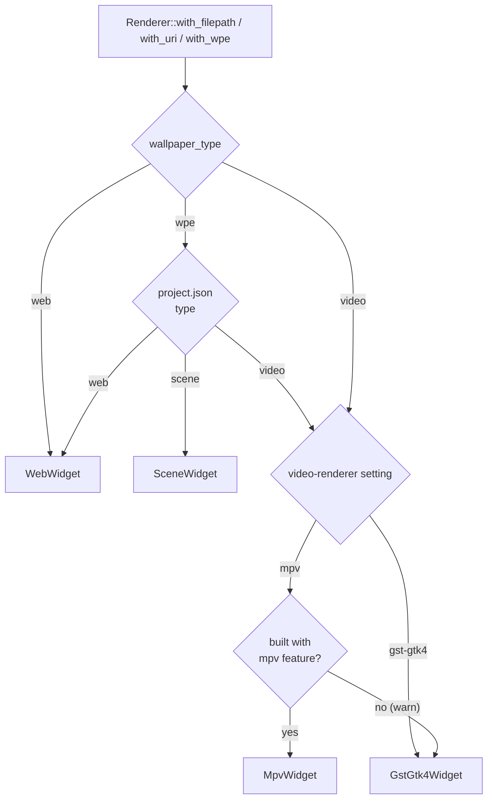
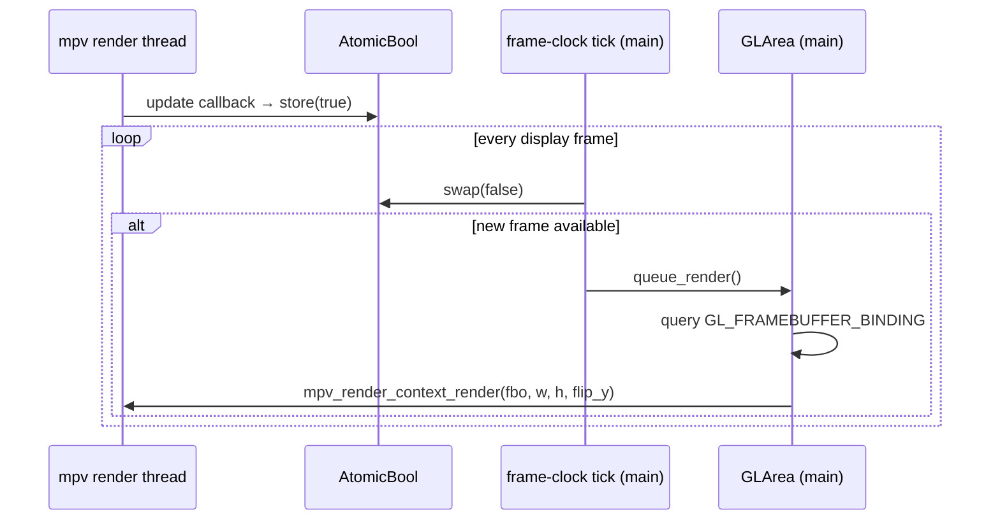

# Video Renderers

Hotaru supports two video renderers plus a web renderer and a Wallpaper
Engine scene renderer. Video renderers are selected at runtime by the
`video-renderer` GSettings key. Changing the key rebuilds the active
wallpaper immediately.

| Renderer | Setting value | Role |
|---|---|---|
| libmpv (`MpvWidget`) | `mpv` | **Default.** Best performance; robust hardware decoding. |
| GStreamer (`GstGtk4Widget`) | `gst-gtk4` | Fallback; GTK-native pipeline, used when built without libmpv. |
| WebKitGTK (`WebWidget`) | — | Not user-selectable; used for `wallpaper_type: web`. |
| linux-wallpaperengine (`SceneWidget`) | — | Not user-selectable; renders **scene**-type `wpe` packages. |

mpv is the default because its `hwdec=auto-safe` reliably engages hardware
decoding across codecs, keeping CPU usage flat where the GStreamer path can
fall back to software decoding.

## Common interface

All renderers are GTK widgets (GObject subclasses of `gtk::Box`) implementing
the `RendererWidget` trait ([widget.rs](../src/widget.rs)):

```rust
trait RendererWidget: AsRef<Widget> {
    fn mirror(&self, enable_graphics_offload: bool, content_fit: ContentFit) -> gtk::Box;
    fn play(&self);  fn pause(&self);  fn stop(&self);
    fn set_volume(&self, volume: i32);          // 0 – 100
    fn set_mute(&self, mute: bool);
    fn set_content_fit(&self, fit: gtk::ContentFit);
}
```

They are held in the `Renderer` enum, dispatched statically via
`enum_dispatch`. `Renderer::with_filepath` / `with_uri` pick the concrete
widget from `WallpaperType` + `VideoRenderer`; a build without the `mpv`
cargo feature transparently downgrades an `mpv` selection to `gst-gtk4` with
a warning. A `wpe` wallpaper is resolved first (see below) and then routed
through the same dispatch as its underlying type.



## Wallpaper Engine packages (`wallpaper_type: wpe`)

A Wallpaper Engine workshop item is a directory with a `project.json` whose
`type` is `scene`, `video`, or `web`. `Renderer::with_wpe` ([wpe.rs](../src/wpe.rs))
resolves the package and delegates by that type:

| `project.json` type | Renderer | Entry passed |
|---|---|---|
| `scene` | `SceneWidget` (linux-wallpaperengine) | the package **directory** |
| `video` | the video renderer (mpv/gst) | `project.json` `file` (the video) |
| `web` | `WebWidget` | `project.json` `file` (`index.html`) |

So video/web packages use hotaru's own (better-tuned) renderers rather than
the engine's built-ins — and they work even in a build without the `scene`
cargo feature; only scene packages need the engine.

The source is either a `filepath` (the package directory) or a `workshop_id`
(resolved to the Steam install: `$HOTARU_WPE_WORKSHOP`, then
`~/.local/share/Steam`, `~/.steam/steam`, `~/.steam/root`, and Flatpak Steam,
under `steamapps/workshop/content/431960/<id>`).

`mirror()` supports clone/stretch modes: it returns a widget showing the same
output as the primary renderer without a second decode pipeline (see
per-renderer notes below).

## MpvWidget (`src/widget/mpv.rs`, cargo feature `mpv`)

libmpv has no GTK video sink, so the widget drives mpv's **OpenGL render
API** (`vo=libmpv`) into a `gtk::GLArea`:

- **Handle setup** — `LC_NUMERIC` is forced back to `"C"` before
  `mpv_create` (libmpv refuses to initialize otherwise, and `gtk::init()`
  applies the user's locale). Options: `loop-file=inf` (wallpapers loop
  forever), `hwdec=auto-safe`, `terminal=yes` + `msg-level=all=warn` so mpv
  errors surface on stderr (the event queue is not drained).
- **GL symbol resolution** — libmpv resolves every GL function through a
  caller-provided `get_proc_address`. GTK exposes no public GL loader, so a
  process-wide resolver dlopens `libEGL.so.1` (`eglGetProcAddress`) or
  `libGL.so.1` (`glXGetProcAddressARB`), chosen by what GDK actually
  realized: Wayland is always EGL; on X11, `gdk_x11_display_get_egl_display()`
  distinguishes EGL from GLX contexts.
- **Render context lifecycle** — created on GLArea `realize` (GL context
  current), freed on `unrealize` (again with the context current, as libmpv
  requires). `RenderContext<'a>` borrows the `Mpv` handle; the widget stores
  it as `RenderContext<'static>` via a documented transmute, with struct
  field order guaranteeing the context drops before the handle.
- **Frame scheduling** — mpv's update callback fires on an mpv thread and
  only sets an `Arc<AtomicBool>`; a frame-clock tick callback on the main
  thread polls the flag and calls `queue_render()`. Redraws therefore happen
  at the video's own rate with no cross-thread GTK calls. The `render`
  signal queries `GL_FRAMEBUFFER_BINDING` (GTK renders GLArea into its own
  FBO, not 0) and calls `mpv_render_context_render` with `flip_y = true`.
- **Property mapping** — `pause`, `volume`, `mute` map directly to mpv
  properties (mpv's volume is the same 0-100 scale). Content fit maps to mpv's own scaling: Fill → `keepaspect=no`,
  Contain → `keepaspect` + `panscan=0`, Cover → `keepaspect` + `panscan=1`.
  File loading is deferred until the render context exists (`loadfile`
  before a VO exists would fail).


- **mirror()** — mpv renders straight into its GLArea and exposes no
  `gdk::Paintable`, so clones use a `gtk::WidgetPaintable` snapshot of the
  GLArea.

## GstGtk4Widget (`src/widget/gstgtk4.rs`)

The GTK-native pipeline: `gst-play` (`gstreamer-play`) with a
`gtk4paintablesink`, whose `gdk::Paintable` is shown by a `gtk::Picture`
(optionally wrapped in `GtkGraphicsOffload` when `enable-graphics-offload`
is set — the sink supports dmabuf import, enabling zero-copy paths).

The sink is statically linked (`gst-plugin-gtk4` crate) and registered at
startup via `gstgtk4::plugin_register_static()`, so hotaru does not depend
on the system's gst-plugins-rs package; if the system provides the plugin
too, GStreamer's registry picks the newer of the two.

- Looping: `PlaySignalAdapter::connect_end_of_stream` seeks back to 0.
- Content fit is the `gtk::Picture` `content-fit` property.
- `mirror()` creates another `gtk::Picture` on the **same paintable**, with
  `content-fit` bound to the primary picture — clones cost one extra
  texture draw, not a pipeline.
- Decoding uses whatever GStreamer elements the system provides; hardware
  decode availability depends on installed plugin sets (VA-API/NVDEC etc.).

## WebWidget (`src/widget/web.rs`)

A WebKitGTK `WebView` loading the configured URI (local file or remote).
Playback controls are no-ops. `mirror()` uses a `gtk::WidgetPaintable` of
the WebView.

## SceneWidget (`src/widget/scene.rs`, cargo feature `wpe`)

Renders **scene**-type Wallpaper Engine packages (the delegation target above)
through
[linux-wallpaperengine](https://github.com/Almamu/linux-wallpaperengine)'s
embedding API (`wpe_embed.h`, on the `feat/embed-api` branch of our fork),
which follows the libmpv render-API model: the host owns the GL context,
frame clock, pointer input and destination FBO, and the engine draws one
frame per call. The widget therefore mirrors `MpvWidget`'s structure:

- **Backend source** — the fork is pinned as a git submodule at
  [third_party/linux-wallpaperengine](../third_party/linux-wallpaperengine).
  Build the library with `make wpe-lib` (inits the submodule recursively,
  then CMake-builds `liblinux-wallpaperengine-lib.so` with `ENABLE_WEB=OFF`,
  so no CEF/Chromium is pulled in — hotaru renders web wallpapers itself).
  Needs `glm`, `glfw`, `glew`, `SDL2`, `mpv`, `lz4`, `freetype` and
  X11/Wayland dev headers.
- **Runtime loading** — the engine library
  (`liblinux-wallpaperengine-lib.so`) is dlopen'd on first use, so hotaru
  builds and runs without it; loading a scene then logs an error instead of
  failing at startup. `HOTARU_WPE_LIBRARY` overrides the library name/path.
- **Assets** — the Wallpaper Engine `assets` directory is auto-detected from
  a Steam installation by the engine; `HOTARU_WPE_ASSETS` overrides it.
- **Desktop GL requirement** — the engine needs OpenGL 3.3 core, not GLES,
  and a GL `GLArea` context cannot share with a GLES GDK display context.
  GDK prefers GLES on some EGL setups (notably NVIDIA), so `main()` appends
  `gles-api` to `GDK_DISABLE` before GTK opens the display when built with
  the `wpe` feature (`HOTARU_ALLOW_GLES=1` opts out). The GLArea is also
  restricted to `GLAPI::GL`.
- **ABI guard** — the FFI structs in `scene.rs` are hand-mirrored from
  `wpe_embed.h`; `wpe_abi_version()` is checked right after dlopen and a
  mismatched library is refused (blank wallpaper + logged error) rather than
  risking a layout-corruption crash. Bump `WPE_EMBED_ABI_VERSION` (header)
  and the `WPE_ABI_VERSION` constant in `scene.rs` in lockstep on any ABI
  change.
- **GL symbols** — resolved through the same process-wide loader as
  `MpvWidget` (`src/widget/gl_loader.rs`).
- **Frame scheduling** — scenes animate continuously: a frame-clock tick
  callback queues a render while playing, capped at `HOTARU_WPE_FPS` FPS
  (default 60) so it doesn't run at full refresh on high-Hz displays. The
  engine derives its scene clock from the host timestamps we pass
  (frame-clock time), so `pause()` freezes the clock
  (`wpe_context_set_paused`) and damage-driven redraws while paused repeat
  the same still frame.
- **Property mapping** — volume 0-100 scales to the engine's 0-128;
  `set_mute` maps to `wpe_context_set_audio_enabled`. Content fit maps to
  the engine's viewport scaling (Fill → `stretch`, Contain → `fit`,
  Cover → `fill`) which is fixed at scene load, so a later
  `set_content_fit` rebuilds the engine context. Pointer motion over the
  GLArea feeds scene parallax/interaction via `wpe_context_set_mouse`.
- **mirror()** — `gtk::WidgetPaintable` snapshot of the GLArea, same as
  `MpvWidget`.

The audio-visualizer capture (PulseAudio + FFT inside the engine) is
disabled; audio-reactive scenes render with a zeroed spectrum.

## Content fit

`content-fit` (GSettings, default **Cover**) supports:

| Value | Meaning | Wallpaper behavior |
|---|---|---|
| 0 Fill | stretch, ignore aspect | fills, may distort |
| 1 Contain | fit inside, keep aspect | letterboxes on mismatch |
| 2 Cover | fill, keep aspect, crop | fills, crops overflow (default) |

`GtkContentFit::ScaleDown` is deliberately not offered: never upscaling makes
sense for image viewers, not wallpapers (a small video would sit at 1:1 in a
sea of black), and mpv has no equivalent.

Note that in **stretch** mode the fit applies to the virtual canvas spanning
all monitors, not to each monitor — with mixed orientations the canvas aspect
can be extreme, which is why Cover (crop) is the default.

